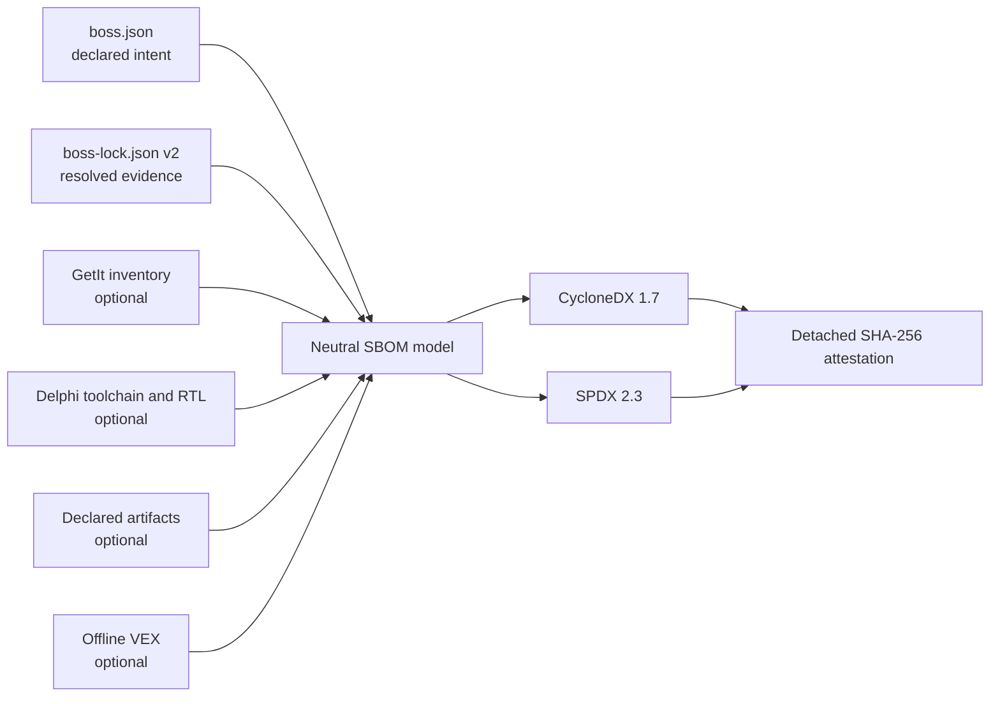

# SBOM support in Boss4Delphi

## Why this feature exists

A Software Bill of Materials (SBOM) is a machine-readable inventory of the
components used to build a product. It helps teams answer questions that are hard
to answer from source folders alone:

- Which exact dependency revisions went into this release?
- Where did each component come from and how can its integrity be checked?
- Which licenses were declared, and where did that evidence originate?
- Is a newly disclosed vulnerability relevant to a shipped application?
- Can two build architectures produce the same dependency inventory?

For Delphi projects this is especially useful because a product may combine
Boss-managed source dependencies, GetIt packages, RAD Studio RTL/toolchain files,
commercial libraries, and compiled DCU/BPL/DLL artifacts. Boss4Delphi makes these
different evidence sources explicit instead of silently presenting an incomplete
inventory as complete.

An SBOM improves transparency and incident response, but it does not by itself
prove legal compliance, guarantee that a component is safe, replace source or
binary analysis, or sign a release.

## What Boss4Delphi provides

Boss4Delphi generates:

- CycloneDX 1.7 JSON;
- SPDX 2.3 JSON;
- deterministic output for reproducible releases;
- strict quality checks for missing lock evidence;
- optional GetIt, Delphi toolchain/RTL, and binary artifact collectors;
- offline VEX enrichment for CycloneDX;
- detached in-toto Statement v1 attestations bound to the SBOM SHA-256.

The basic generator is native and offline. It does not require Node.js, a cloud
service, a commercial scanner, or network access.

## Evidence model



`boss.json` records project intent. `boss-lock.json` records what was actually
resolved: canonical repository identity, revision, checksum, license provenance,
dependency edges, and root metadata. The lock is authoritative for release
versions and revisions.

The internal domain model is format-neutral. CycloneDX and SPDX are serializers of
the same evidence, which prevents format-specific behavior from changing dependency
resolution semantics.

## Two generation modes

### Project mode

Project mode reads `boss.json` and `boss-lock.json`. Use it during development or
when manual components declared in the manifest must be included:

```bash
boss4d sbom --format cyclonedx --output bom.cdx.json --validate
```

### Lock-only release mode

Lock-only mode reads only `boss-lock.json` and never requires `boss.json`. Use it
for deterministic releases after running `boss4d install` with the current CLI:

```bash
boss4d sbom --format cyclonedx --lock-only --strict --validate \
  --reproducible --output dist/sbom/app.cdx.json
```

`--strict` fails instead of accepting missing identity, revision, checksum, graph,
or root evidence. Environmental collectors cannot be combined with `--lock-only`
because they would make the result depend on the build machine.

## Understanding coverage

Boss-managed dependencies are known from the manifest and lock. Other components
require separate evidence:

- `--include-getit` inventories installed GetIt packages. Installation alone does
  not prove project usage, so these packages are not automatically linked as root
  dependencies. Declare `"source": "getit"` in `sbom.components` to assert usage.
- `--include-toolchain` records detected Delphi installations and hashes/version
  evidence for `dcc32`, `dcc64`, and Win32/Win64 `System.dcu` files.
- `--include-artifacts` hashes dependency artifacts declared in the lock. Their
  explicit base is `project`, `module`, or `absolute`; path traversal is rejected.
- Commercial SDKs or other components that cannot be discovered can be declared
  manually in `boss.json` with name, version, license, repository, and hash.

Collector failure is reported as incomplete coverage. It is never converted into
an empty inventory, because “nothing was found” and “discovery failed” are different
security statements.

## VEX and vulnerability context

A VEX document explains whether a known vulnerability affects a particular product
component. Boss4Delphi imports an offline JSON file into CycloneDX with states
`affected`, `not_affected`, `fixed`, or `under_investigation`:

```bash
boss4d sbom --format cyclonedx --vex security.vex.json \
  --output app.vex.cdx.json --validate
```

Boss4Delphi does not maintain a vulnerability database or perform a network SCA
lookup. VEX is supplied by the user or an external security process. SPDX 2.3 VEX
is rejected rather than silently discarded because its equivalent security profile
belongs to SPDX 3.

## Attestations and their limit

`--attestation-output` creates a detached in-toto Statement that stores the exact
SBOM SHA-256. `--verify-attestation` regenerates the document and fails if its bytes
do not match:

```bash
boss4d sbom --format cyclonedx --lock-only --strict --validate --reproducible \
  --output app.cdx.json --attestation-output app.cdx.intoto.json
```

This proves content integrity and catches tampering. The current attestation is not
an identity-bearing digital signature and is not automatically published to a
transparency log. Those can be added later through the neutral signing interfaces.

## Recommended release workflow

1. Run `boss4d install` and commit the v2 lock.
2. Run `scripts/ci-verify-sbom.ps1` on Windows with Delphi 13.
3. Run `build_release.bat`; it builds into staging and promotes `dist` only after
   all required targets and SBOMs succeed.
4. Publish CycloneDX, SPDX, both attestations, the installer, and SHA-256 checksums.
5. Keep the SBOM beside the exact release/tag it describes.
6. When a vulnerability appears, use the released SBOM to identify candidates and
   publish reviewed VEX status separately.

The local matrix is authoritative for this project. The GitHub Actions workflow is
optional manual automation for a self-hosted Windows/Delphi runner.

## Where to go next

- [Copyable commands and JSON examples](sbom-examples.md)
- [CLI reference](usage.md#71-sbom-generation-sbom)
- [Migrating to lock schema v2](sbom-migration.md)
- [Release checklist](sbom-release-checklist.md)
- [Architecture roadmap and decisions](sbom-roadmap.pt-BR.md) (Portuguese)
