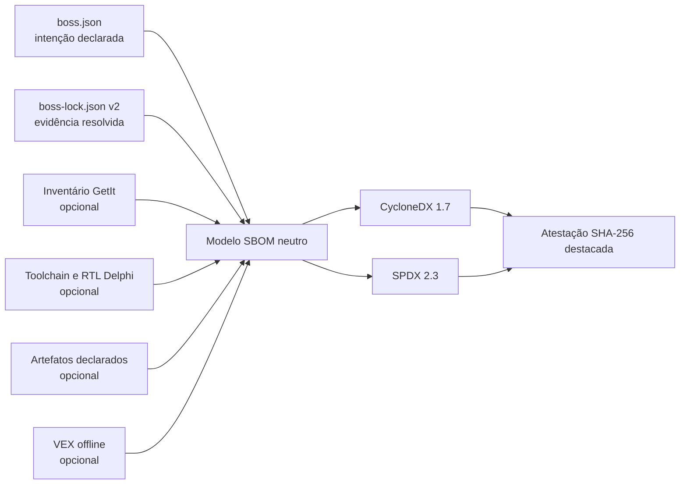

# Suporte a SBOM no Boss4Delphi

## Por que esta feature existe

Uma Software Bill of Materials (SBOM) é um inventário legível por máquina dos
componentes usados para construir um produto. Ela ajuda a responder perguntas que
somente as pastas de código-fonte não respondem bem:

- Quais revisões exatas das dependências entraram nesta release?
- De onde veio cada componente e como verificar sua integridade?
- Quais licenças foram declaradas e qual é a origem dessa evidência?
- Uma vulnerabilidade recém-divulgada é relevante para o produto entregue?
- Duas arquiteturas de build produzem o mesmo inventário de dependências?

Em projetos Delphi isso é especialmente importante porque um produto pode combinar
dependências de fonte gerenciadas pelo Boss, pacotes GetIt, RTL/toolchain do RAD
Studio, bibliotecas comerciais e artefatos DCU/BPL/DLL. O Boss4Delphi torna essas
fontes de evidência explícitas, sem apresentar silenciosamente um inventário
incompleto como completo.

Uma SBOM melhora transparência e resposta a incidentes, mas isoladamente não prova
conformidade legal, não garante que um componente seja seguro, não substitui análise
de fonte/binário e não assina uma release.

## O que o Boss4Delphi oferece

O Boss4Delphi gera:

- CycloneDX 1.7 JSON;
- SPDX 2.3 JSON;
- saída determinística para releases reproduzíveis;
- validação estrita de evidências ausentes no lock;
- coletores opcionais de GetIt, toolchain/RTL Delphi e artefatos binários;
- enriquecimento VEX offline para CycloneDX;
- atestações destacadas in-toto Statement v1 ligadas ao SHA-256 da SBOM.

O gerador básico é nativo e offline. Não exige Node.js, serviço em nuvem, scanner
comercial ou acesso à rede.

## Modelo de evidências



`boss.json` registra a intenção do projeto. `boss-lock.json` registra o que foi
efetivamente resolvido: identidade canônica do repositório, revisão, checksum,
origem da licença, arestas de dependência e metadados da raiz. O lock é autoritativo
para versões e revisões de release.

O modelo de domínio interno é neutro. CycloneDX e SPDX são serializações da mesma
evidência, evitando que detalhes de formato alterem a resolução de dependências.

## Dois modos de geração

### Modo projeto

O modo projeto lê `boss.json` e `boss-lock.json`. Use durante o desenvolvimento ou
quando componentes manuais declarados no manifesto precisarem ser incluídos:

```bash
boss4d sbom --format cyclonedx --output bom.cdx.json --validate
```

### Modo de release apenas com lock

O modo lock-only lê somente `boss-lock.json` e não exige `boss.json`. Use para
releases determinísticas depois de executar `boss4d install` com a CLI atual:

```bash
boss4d sbom --format cyclonedx --lock-only --strict --validate \
  --reproducible --output dist/sbom/app.cdx.json
```

`--strict` falha em vez de aceitar ausência de identidade, revisão, checksum, grafo
ou evidência da raiz. Coletores ambientais não podem ser combinados com
`--lock-only`, pois tornariam o resultado dependente da máquina de build.

## Entendendo a cobertura

Dependências gerenciadas pelo Boss são conhecidas pelo manifesto e lock. Outros
componentes precisam de evidência separada:

- `--include-getit` inventaria pacotes GetIt instalados. Instalação não prova uso
  pelo projeto; por isso eles não viram automaticamente dependências da raiz.
  Declare `"source": "getit"` em `sbom.components` para afirmar uso.
- `--include-toolchain` registra instalações Delphi detectadas e evidências de
  versão/hash para `dcc32`, `dcc64` e `System.dcu` Win32/Win64.
- `--include-artifacts` calcula hashes dos artefatos declarados no lock. A base
  explícita é `project`, `module` ou `absolute`; traversal é rejeitado.
- SDKs comerciais e componentes não descobertos podem ser declarados manualmente
  no `boss.json` com nome, versão, licença, repositório e hash.

Falha de coletor é reportada como cobertura incompleta. Ela nunca é convertida em
inventário vazio, pois “nada foi encontrado” e “a descoberta falhou” são afirmações
de segurança diferentes.

## VEX e contexto de vulnerabilidade

Um documento VEX explica se uma vulnerabilidade conhecida afeta um componente do
produto. O Boss4Delphi importa JSON offline no CycloneDX com os estados `affected`,
`not_affected`, `fixed` ou `under_investigation`:

```bash
boss4d sbom --format cyclonedx --vex security.vex.json \
  --output app.vex.cdx.json --validate
```

O Boss4Delphi não mantém banco de vulnerabilidades nem realiza consulta SCA em
rede. O VEX é fornecido pelo usuário ou por um processo de segurança externo. VEX
com SPDX 2.3 é recusado em vez de descartado silenciosamente, pois o perfil de
segurança equivalente pertence ao SPDX 3.

## Atestações e seus limites

`--attestation-output` cria um in-toto Statement destacado com o SHA-256 exato da
SBOM. `--verify-attestation` regenera o documento e falha se os bytes divergirem:

```bash
boss4d sbom --format cyclonedx --lock-only --strict --validate --reproducible \
  --output app.cdx.json --attestation-output app.cdx.intoto.json
```

Isso comprova integridade do conteúdo e detecta adulteração. A atestação atual não
é assinatura digital vinculada à identidade e não é publicada automaticamente em
transparency log. Essas integrações podem ser adicionadas pelas interfaces neutras
de assinatura.

## Fluxo recomendado de release

1. Execute `boss4d install` e versione o lock v2.
2. Execute `scripts/ci-verify-sbom.ps1` no Windows com Delphi 13.
3. Execute `build_release.bat`; ele compila em staging e só promove `dist` quando
   todos os alvos e SBOMs forem concluídos.
4. Publique CycloneDX, SPDX, as duas atestações, instalador e checksums SHA-256.
5. Mantenha a SBOM junto da tag/release exata que ela descreve.
6. Quando surgir uma vulnerabilidade, use a SBOM publicada para identificar
   candidatos e publique o status VEX revisado separadamente.

A matriz local é autoritativa neste projeto. GitHub Actions é somente uma automação
manual opcional para runner Windows/Delphi self-hosted.

## Próximos documentos

- [Comandos e exemplos JSON copiáveis](sbom-examples.pt-BR.md)
- [Referência da CLI](usage.pt-BR.md#71-geração-de-sbom-sbom)
- [Migração para o schema v2 do lock](sbom-migration.pt-BR.md)
- [Checklist de release](sbom-release-checklist.pt-BR.md)
- [Roadmap e decisões arquiteturais](sbom-roadmap.pt-BR.md)
